# Artificial intelligence


## Course Sturcuture

- Classification
    - [Image Classification](https://cs231n.github.io/classification/)
    - [Data Classification](https://www.kaggle.com/)

- Agent
    - [Reinforcement Learning](https://web.stanford.edu/class/cs234/)

- Generative model
    - GPT API usage (prompt Energineering)
    - Diffussion Model


## Intelligence

In this segment, we'll explore intelligence, particularly focusing on how the intelligence in Artificial Intelligence differs from traditional defination of intelligence.

- **Traditional Intelligence**: Often refers to human intelligence, which is a complex combination of cognitive abilities including learning, reasoning, problem-solving, perception, language understanding, and emotional knowledge. It's inherently flexible, adaptable, and capable of understanding context and abstract concepts.

<p align="center">
    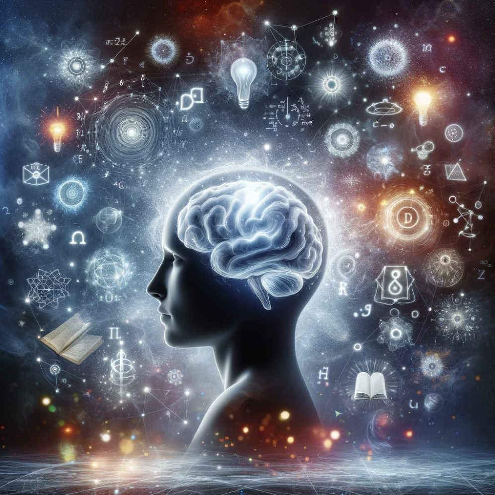
</p>

- **Intelligence in Artificial Intelligence**: AI intelligence is rooted in the ability of a machine or software to perform tasks that typically require human intelligence. This includes pattern recognition, decision-making, and language processing. However, AI operates within the confines of its programming and the data it has been trained on.


## Artificial intelligence

In this section we will talk about the objective of Artificial intelligence.

<p align="center">
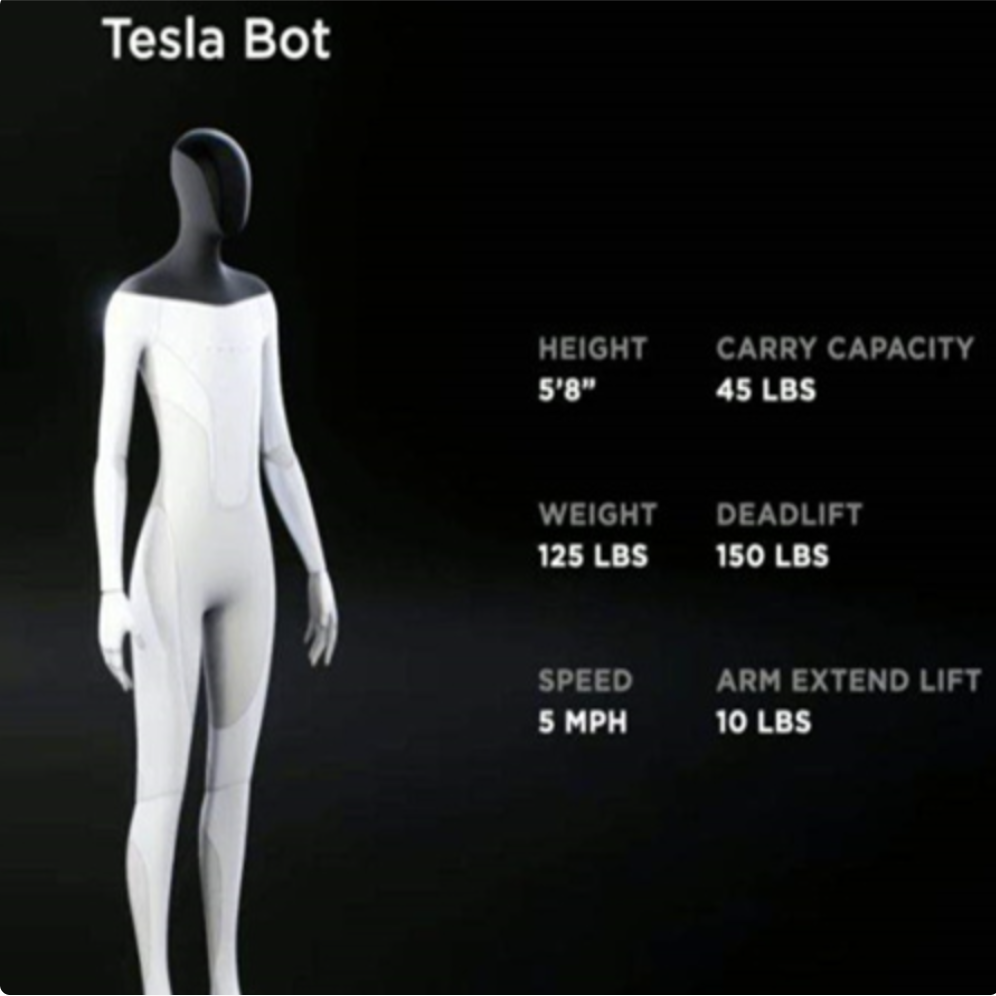
</p>

Artificial General Intelligence (AGI)

<p align="center">
  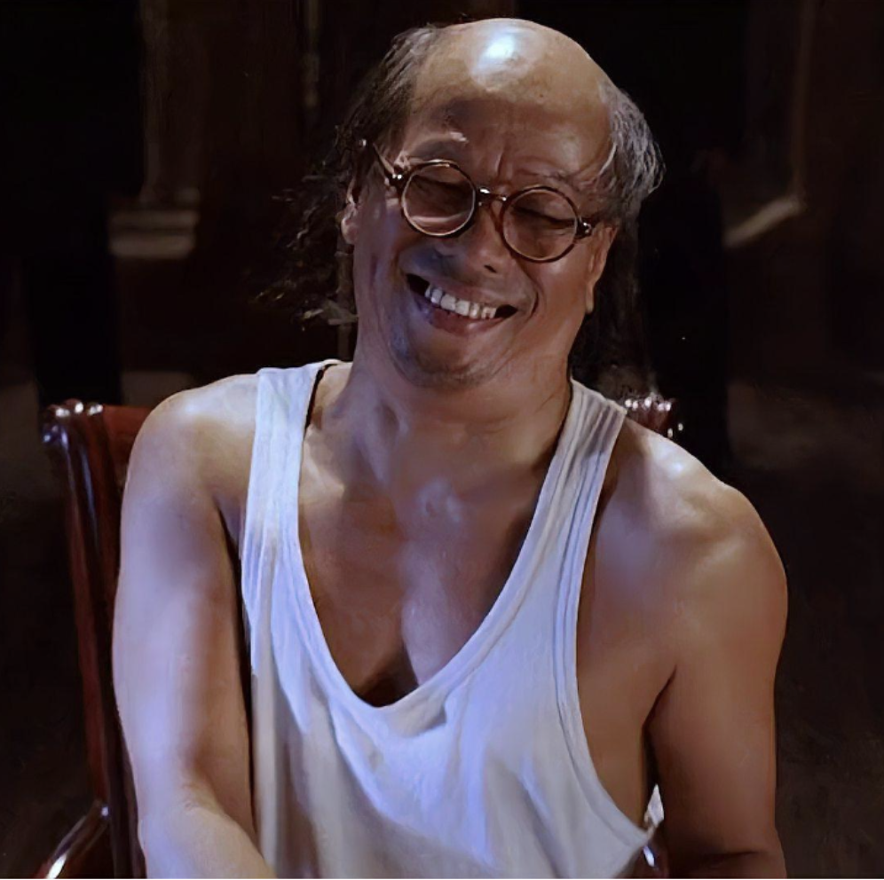
  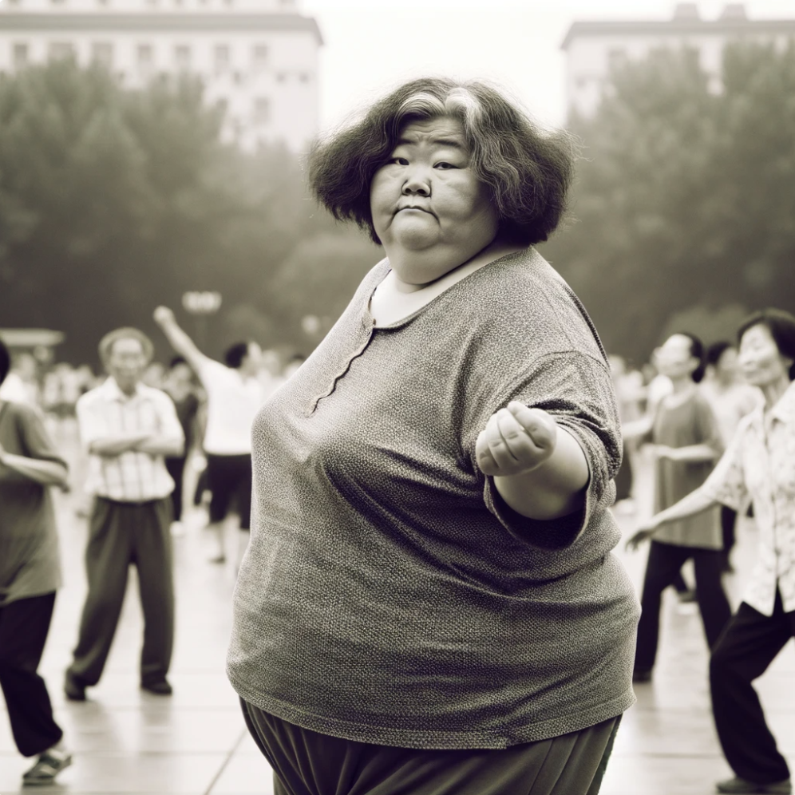
</p>

Artificial intelligence has beaten humans in many fields

<p align="center">
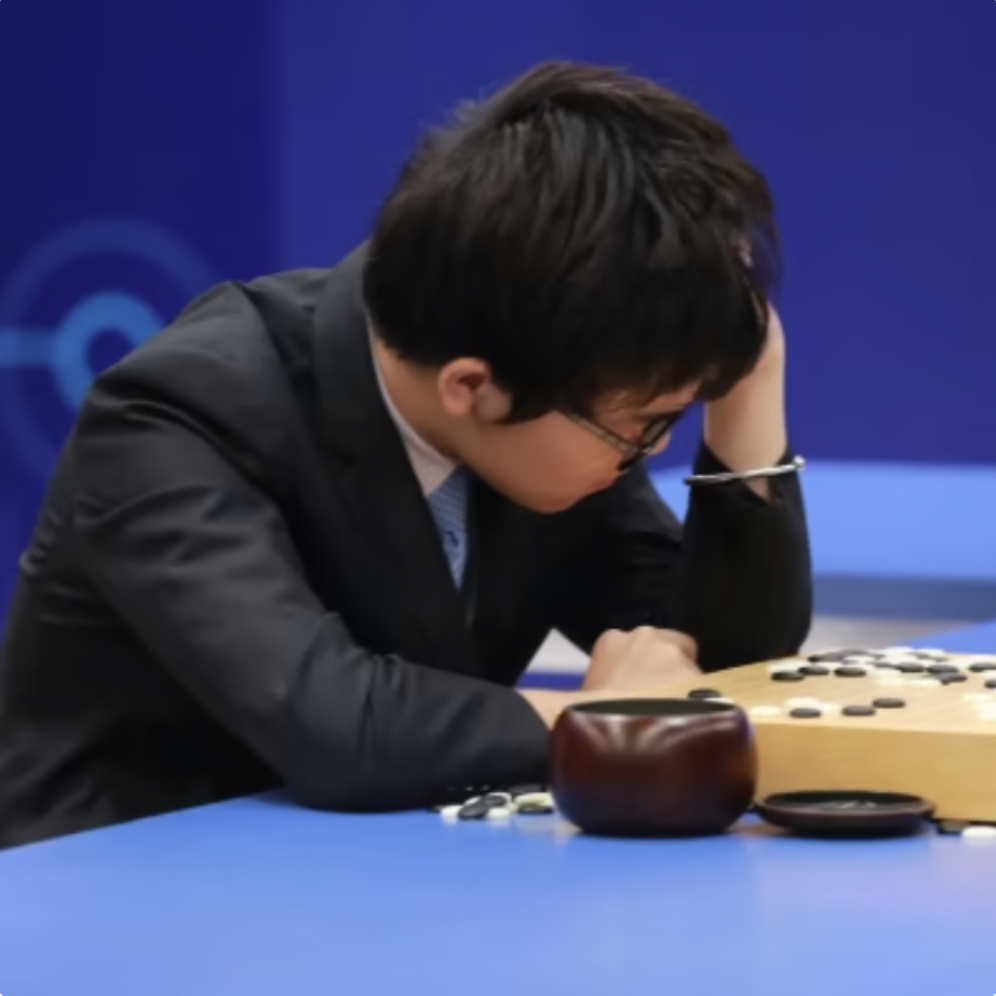
</p>

## Image classification: Overview

### **Motivation**: 

In this section we will introduce the `Image Classification` problem, which is the task of assigning an input image one label from a fixed set of categories. 

This is one of the core problems in Computer Vision that, despite its simplicity, has a large variety of practical applications.

<p align="center">
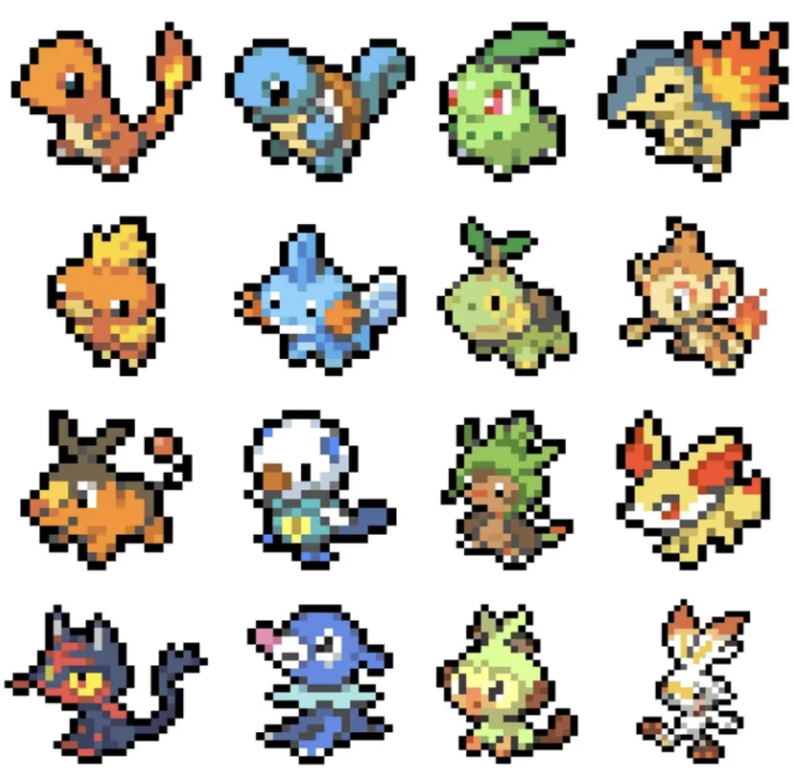
</p>


### **How Computer see Pictures?**: 

**Color mode**

RGB mode refers to a color model used in various devices such as computer monitors, television screens, digital cameras, and scanners. RGB stands for Red, Green, and Blue, the three primary colors of light. In this model, colors are created by combining these three colors in varying intensities. 

<p align="center">
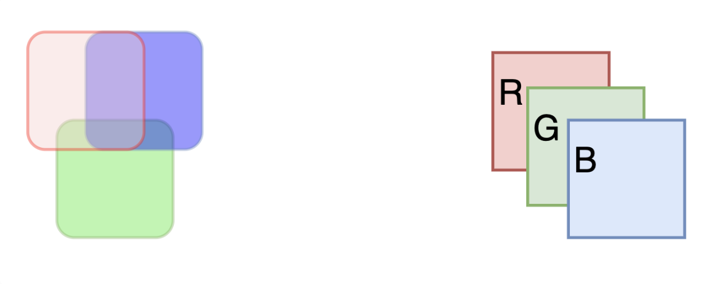
</p>

Here's a example of how it works: [Color Picker](https://convertingcolors.com/rgb-color-253_125_111.html)

---

**Picture**


<p align="center">
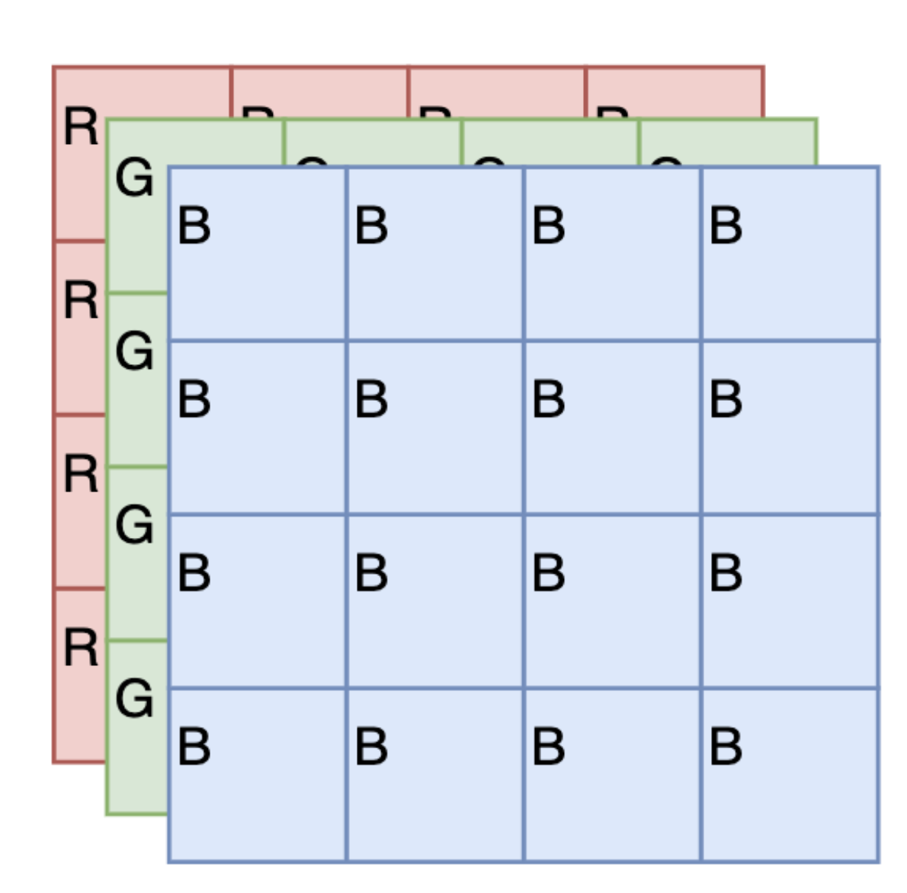
</p>

For example, the cat image below is `250` pixels wide, 400 pixels tall, and has three color channels Red,Green,Blue (or RGB for short). 

Therefore, the image consists of `248 x 400 x 3` numbers, or a total of `297,600` numbers. Each number is an integer that ranges from `0` (black) to `255` (white). 

Our task is to turn this quarter of a million numbers into a single label, such as “cat”.
<p align="center">
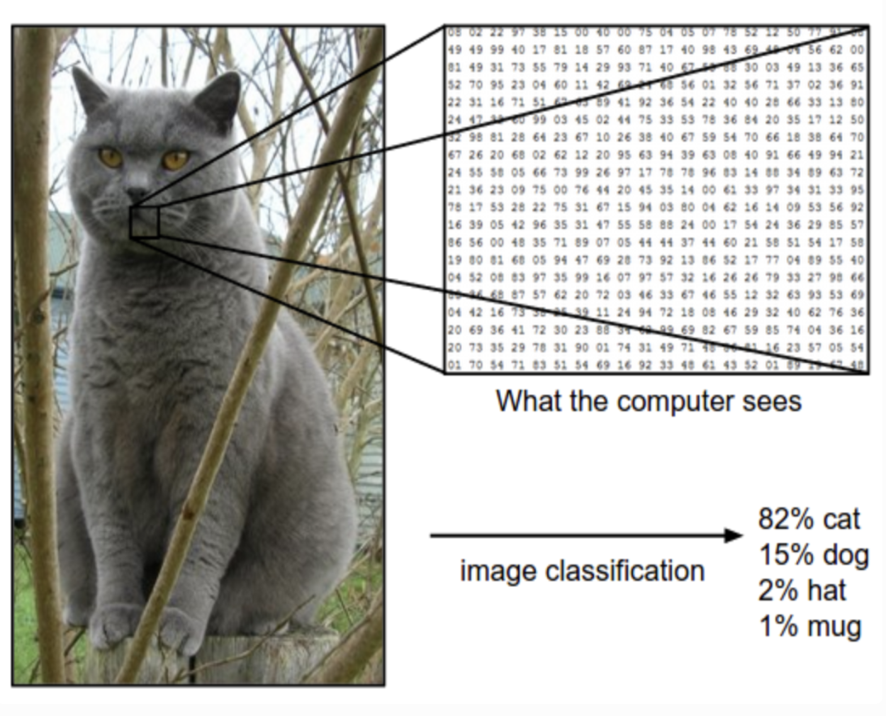
</p>

### **Challenges** 

<p align="center">
    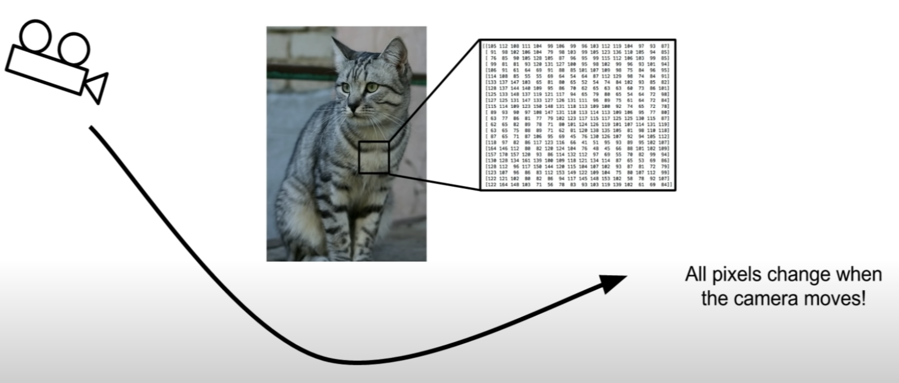
</p>


Since this task of recognizing a visual concept (e.g. cat) is relatively trivial for a human to perform, it is worth considering the challenges involved from the perspective of a Computer Vision algorithm. As we present (an inexhaustive) list of challenges below, keep in mind the raw representation of images as a 3-D array of brightness values:

<p align="center">
    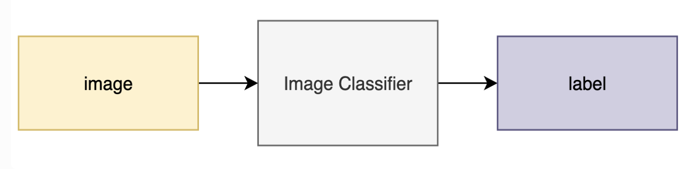
</p>


- Viewpoint variation. A single instance of an object can be oriented in many ways with respect to the camera.
- Scale variation. Visual classes often exhibit variation in their size (size in the real world, not only in terms of their extent in the image).
- Deformation. Many objects of interest are not rigid bodies and can be deformed in extreme ways.
- Occlusion. The objects of interest can be occluded. Sometimes only a small portion of an object (as little as few pixels) could be visible.
Illumination conditions. The effects of illumination are drastic on the pixel level.
- Background clutter. The objects of interest may blend into their environment, making them hard to identify.
- Intra-class variation. The classes of interest can often be relatively broad, such as chair. There are many different types of these objects, each with their own appearance.


<p align="center">
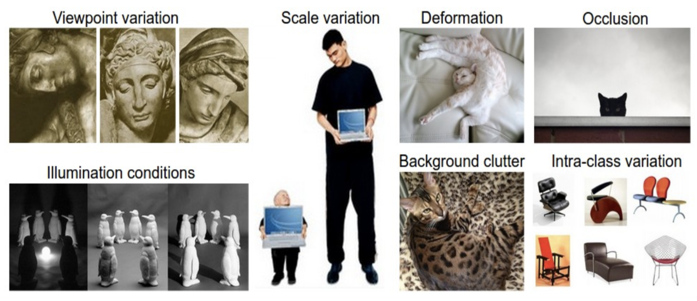
</p>

### Attempts has been made

<p align="center">
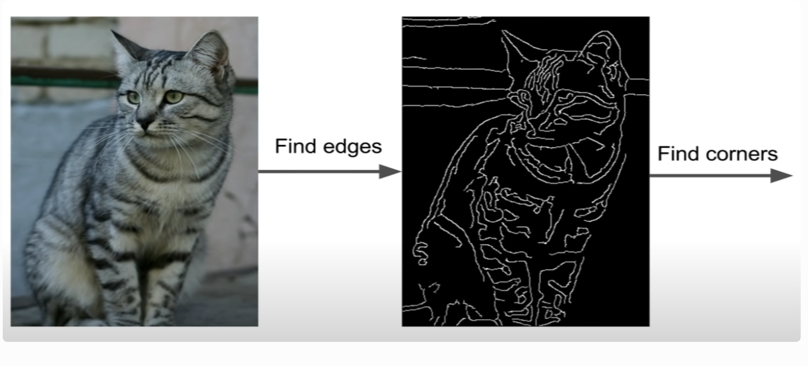
</p>


### **Data-driven approach**

How might we go about writing an algorithm that can classify images into distinct categories? Unlike writing an algorithm for, for example, sorting a list of numbers, it is not obvious how one might write an algorithm for identifying cats in images. Therefore, instead of trying to specify what every one of the categories of interest look like directly in code, the approach that we will take is not unlike one you would take with a child: we’re going to provide the computer with many examples of each class and then develop learning algorithms that look at these examples and learn about the visual appearance of each class. This approach is referred to as a data-driven approach, since it relies on first accumulating a training dataset of labeled images. Here is an example of what such a dataset might look like:

**Image Classification Dataset: CIFAR-10**

One popular toy image classification dataset is the [CIFAR-10](https://www.cs.toronto.edu/~kriz/cifar.html) dataset. 

This dataset consists of `60,000` tiny images that are `32` pixels high and wide. Each image is labeled with one of `10` classes (for example “airplane, automobile, bird, etc”). 

<p align="center">
    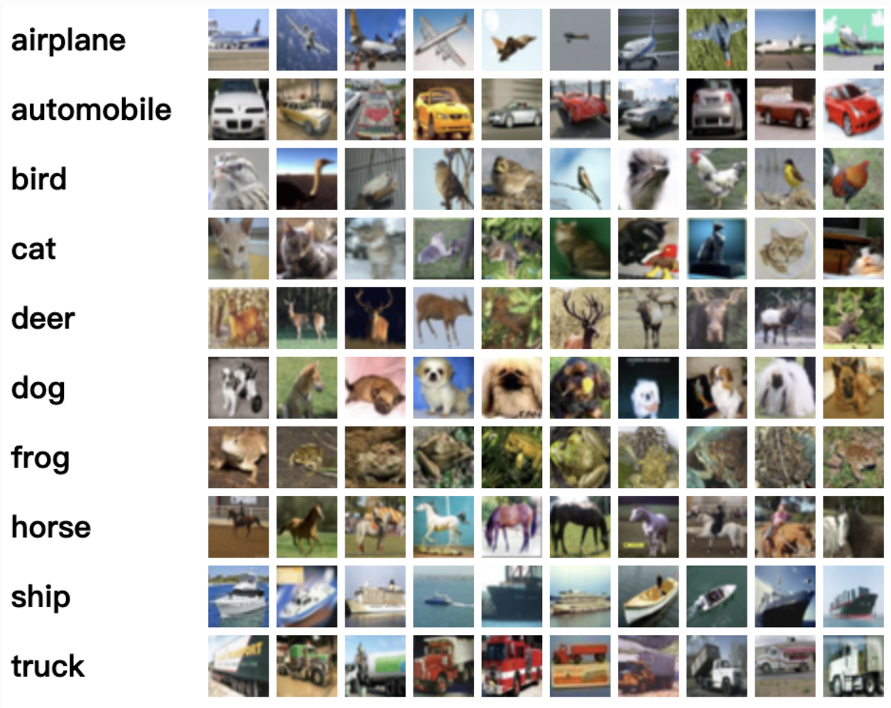
</p>


**Image classification pipeline**

We’ve seen that the task in Image Classification is to take an array of pixels that represents a single image and assign a label to it. Our complete pipeline can be formalized as follows:

- Input: Our input consists of a set of `N` images, each labeled with one of `K` different classes. We refer to this data as the training set.
- Learning: Our task is to use the training set to learn what every one of the classes looks like. We refer to this step as training a classifier, or learning a model.
- Evaluation: In the end, we evaluate the quality of the classifier by asking it to predict labels for a new set of images that it has never seen before. We will then compare the true labels of these images to the ones predicted by the classifier. Intuitively, we’re hoping that a lot of the predictions match up with the true answers (which we call the ground truth).


<p align="center">
    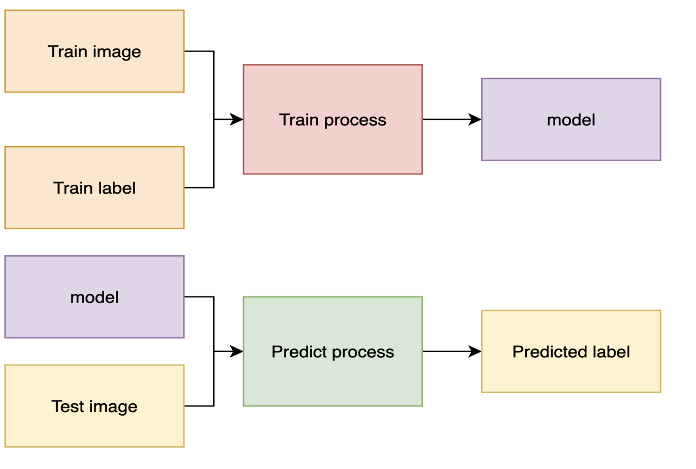
</p>


## Nearest Neighbor Classifier

As our first approach, we will develop what we call a `Nearest Neighbor Classifier`. This classifier has nothing to do with Deep Neural Networks and it is very rarely used in practice, but it will allow us to get an idea about the basic approach to an image classification problem.


### Nearest neighbor Algroithm

Suppose now that we are given the CIFAR-10 training set of 50,000 images (5,000 images for every one of the labels), and we wish to label the remaining 10,000. 

<p align="center">
    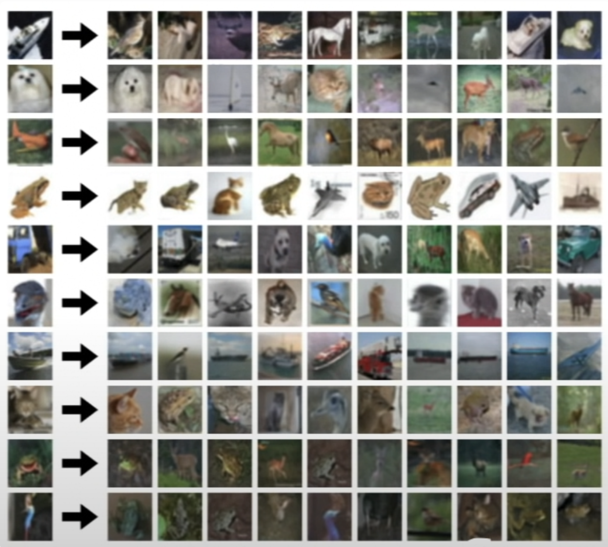
</p>

The nearest neighbor classifier will take a test image, compare it to every single one of the training images, and predict the label of the closest training image. 

In the image above and on the right you can see an example result of such a procedure for 10 example test images. Notice that in only about 3 out of 10 examples an image of the same class is retrieved, while in the other 7 examples this is not the case. For example, in the 8th row the nearest training image to the horse head is a red car, presumably due to the strong black background. As a result, this image of a horse would in this case be mislabeled as a car.


You may have noticed that we left unspecified the details of exactly how we compare two images, which in this case are just two blocks of `32 x 32 x 3`. One of the simplest possibilities is to compare the images pixel by pixel and add up all the differences. In other words, given two images and representing them as vectors I<sub>1</sub>, I<sub>2</sub>, a reasonable choice for comparing them might be the L<sub>1</sub> distance:

 
<p align="center">
    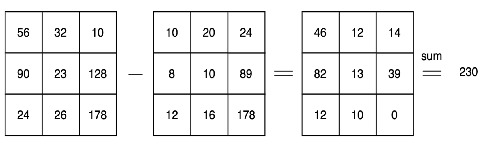
</p>


**Exercise**
What's the L1 distance between the following two matrix?

<p align="center">
    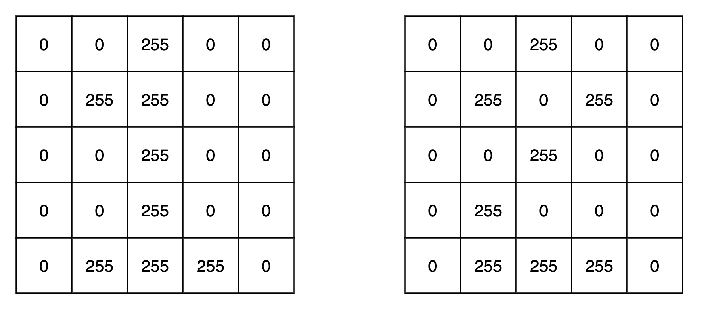
</p>


### The choice of distance

There are many other ways of computing distances between vectors. Another common choice could be to instead use the L<sub>2</sub> distance, which has the geometric interpretation of computing the euclidean distance between two vectors. The distance takes the form:


**L1 vs. L2** 

It is interesting to consider differences between the two metrics. In particular, the L<sub>2</sub> distance is much more unforgiving than the L<sub>1</sub> distance when it comes to differences between two vectors. That is, the L<sub>2</sub> distance prefers many medium disagreements to one big one. L<sub>1</sub> and L<sub>2</sub> distances (or equivalently the L<sub>1</sub>/L<sub>2</sub> norms of the differences between a pair of images) are the most commonly used special cases of a p-norm.


<p align="center">
    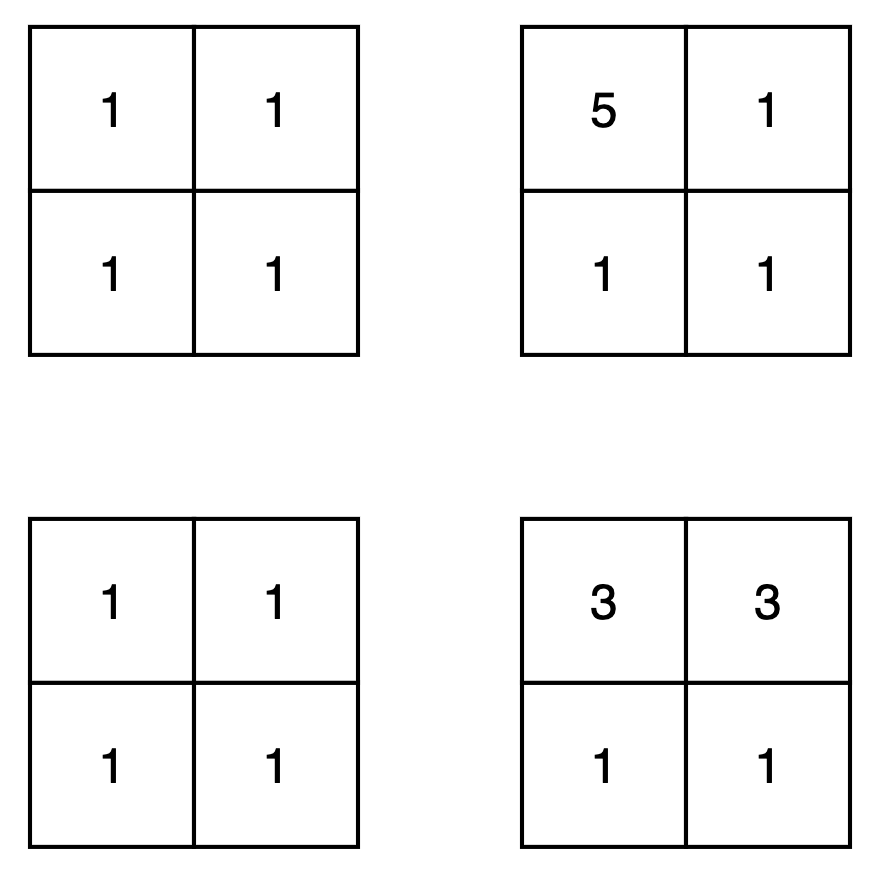
</p>

What's the L1 distance and L2 distance of below two?

<p align="center">
    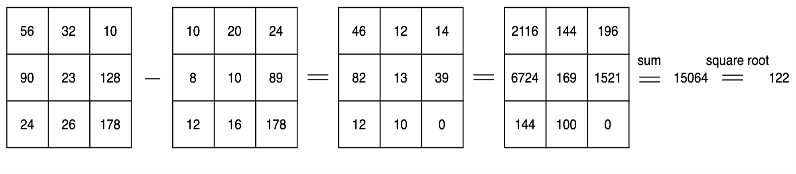
</p>


### Disadvatage of Nearest neighbor Algroithm

1. Very slow at test time
2. Distance matrix on pixel
<p align="center">
    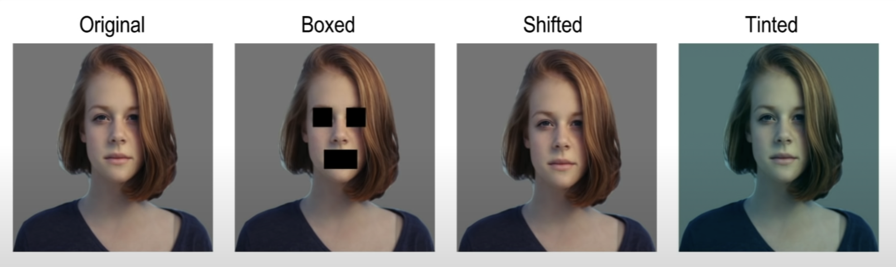
</p>
3. Curse of dimensionality
<p align="center">
    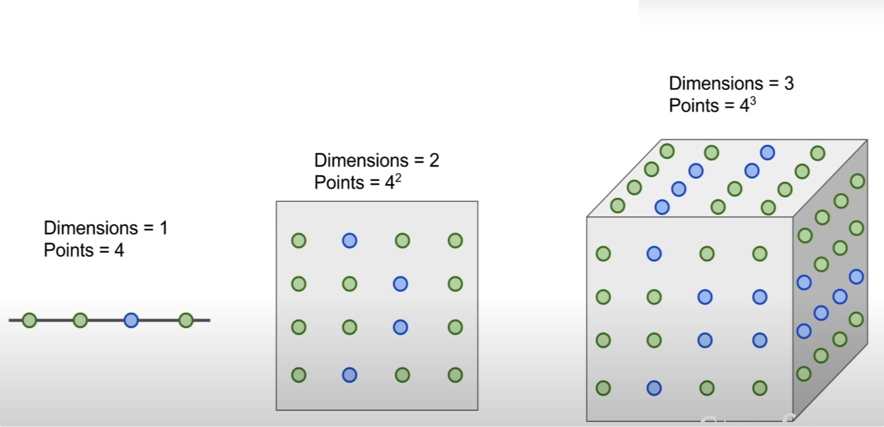
</p>


## Basic Numpy Method
NumPy (Numerical Python) is an open source Python library that’s used in almost every field of science and engineering. It’s the universal standard for working with numerical data in Python, and it’s at the core of the scientific Python and PyData ecosystems.

**Installing NumPy**

```
pip install numpy
```

**Numpy Arrays**

We can initialize NumPy arrays is from Python lists.

```python
import numpy as np

# A vector is an array with a single dimension (1d)
_1_d_array = np.array([1, 2, 3, 4, 5, 6])   # this is a vector

# This is a matrix (2d)
_2_d_array = np.array([[1, 2, 3, 4], 
                        [5, 6, 7, 8], 
                        [9, 10, 11, 12]])   # this is a 2d array with shape (3, 4)

# 3-D or higher dimensional arrays, the term tensor is also commonly used.

print(_2_d_array[0]) # => [1, 2, 3, 4]

print(_2_d_array.shape) # => (3, 4)
```

NumPy arrays are faster and more compact than Python lists. An array consumes less memory and is convenient to use. NumPy uses much less memory to store data and it provides a mechanism of specifying the data types. This allows the code to be optimized even further.

**Numpy Arrays Operations**
```python
arr = np.array([2, -1, 5, 3, 7, 4, 6, 8])

np.sort(arr)                        # array([-1, 2, 3, 4, 5, 6, 7, 8])
np.abs(arr)                         # array([1, 2, 3, 4, 5, 6, 7, 8])
np.sum(arr)                         # 34
np.pow(arr, 2)                      # array([ 4,  0, 25,  9, 49, 16, 36, 64])


arr = np.array([2, 0, 5, 3, 7, 4, 6, 8])
np.sqrt(arr)        # array([1.41421356, 0.        , 2.23606798, 1.73205081, 2.64575131,
                    #        2.        , 2.44948974, 2.82842712])
```
Note that `np.sort`, `np.abs`, `np.sum`, ..., `np.sqrt` can be applied to vector(1-d array), matrix and tensor.

```python
a = np.array([1, 2, 3, 4])
b = np.array([5, 6, 7, 8])

np.concatenate((a, b))                  # array([1, 2, 3, 4, 5, 6, 7, 8])

x = np.array([[1, 2], [3, 4]])
y = np.array([[5, 6]])

np.sum(x, axis = 0)                     # array([4, 6])

np.concatenate((x, y), axis=0)          # array([[1, 2],
                                        #        [3, 4],
                                        #        [5, 6]])
```


```python
np.bincount(np.array([0, 1, 1, 3, 2, 1, 7])) # array([1, 3, 1, 1, 0, 0, 0, 1])
```

Note that `np.bincount` can only be applied to vector (1-d array)


```python
x = np.array([10, 11, 12, 13, 10, 15])
np.argmin(x)                            # 0 (the index of smallest element) 

a = np.array([[10, 11, 12],
              [13, 14, 15]])

np.argmax(a)            # 5 (the index of 15: the index is into the flattened array)
np.argmax(a, axis=0)                    # array([1, 1, 1])
np.argmax(a, axis=1)                    # array([2, 2])


x = np.array([3, 1, 2])
np.argsort(x)                           # array([1, 2, 0])  

```

**Numpy Arrays Slicing**

```python
data = np.array([1, 2, 3])

data[1]                                 # 2
data[0:2]                               # array([1, 2])

data[[0, 2]]                            # [1, 3]
data[[1, 2]]                            # [2, 3]

a = np.array([[1 , 2, 3, 4], [5, 6, 7, 8], [9, 10, 11, 12]])

matrix = np.array([[1, 2], [3, 4], [5, 6]])

matrix[:, 0]                            # array([1, 3, 5]) (column 0)
matrix[0, :]                            # array([1, 2]) (row 0)


data = np.array([3, 1, 2])
data[np.argsort(data) ]                 # array([1, 2, 3])
```


**Reshape An Numpy Array**

```python
data.reshape(2, 3)                      # array([[1, 2, 3],
                                        #        [4, 5, 6]])

data.reshape(3, 2)                      # array([[1, 2],
                                        #        [3, 4],
                                        #        [5, 6]])
```

<p align="center">
    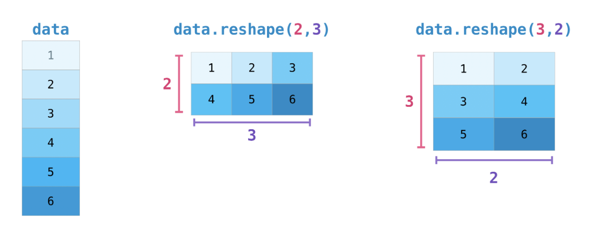
</p>


**Transposing An Numpy Array**


<p align="center">
    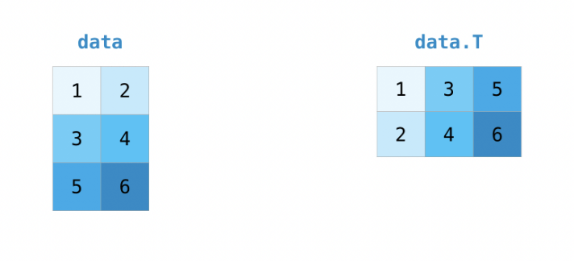
</p>

```python
arr.transpose()     # array([[0, 3],
                    #        [1, 4],
                    #        [2, 5]])

# arr.transpose() is same as arr.T

```

**Example to compute L2 distance**


```python
# Suppose A is an image and B is another image
# Then the L2 distance is:

np.sqrt(np.sum(np.power(A - B, 2)))
```


## KNN Implementation

see Lecture.ipynb


  